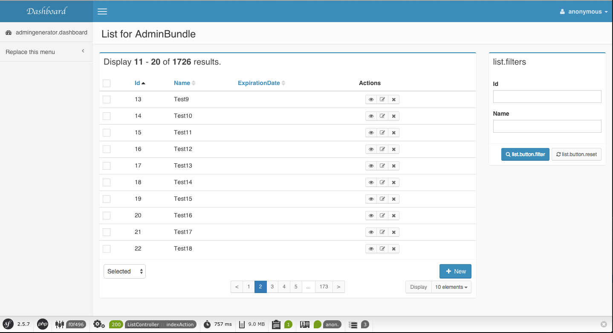
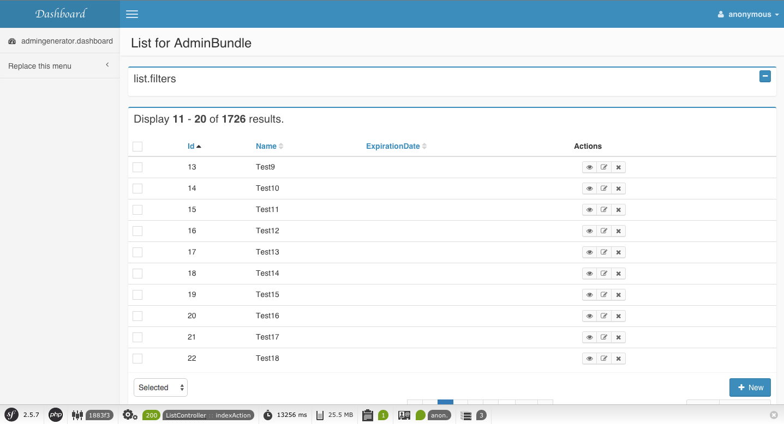
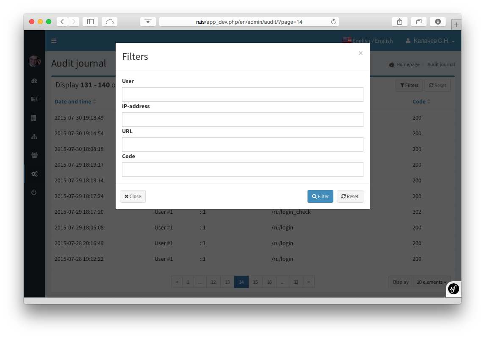
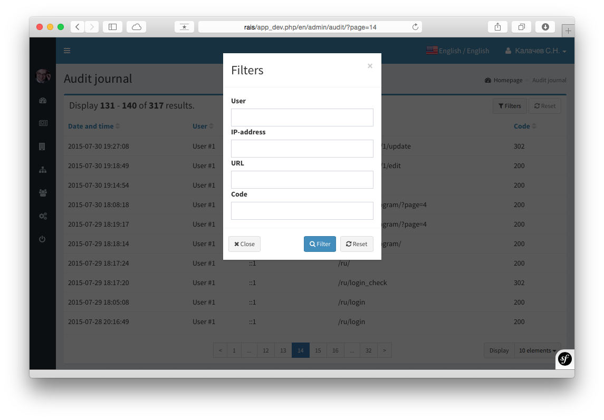

# Filter builder configuration

[go back to Table of contents][back-to-index]

-----

Filters are configured in the List builder part of the generator configuration file, but they have a seperate page as they can still be quite complex. Visit the [List builder][list-builder] documentation if you want to configure the list view.

There are two types of filters:
- [Filters](#filters): Filters created by users. They are form which can be submitted with user data. The exact position of the filter on the page can be [configured](#filter-position).
- [Scopes](#scopes): Scopes are predefined filters which can be clicked by the user.

## Filters

Building filters is actually really simple: by default they use the global form configuration for the filterForm (set with `formType`, `formOptions` and `addFormOptions`. However there are also dedicated `filtersType`, `filterOptions` and `addFilterOptions` to configure the filters completely seperated from the normal form. This might be convenient when the filterFormType is different than the normal FormType.

Filters can be specified in the `filters` parameter of the list builder and are specified as an array:

```yaml
builders:
  list:
    params:
	  filters: [ name, gender ]
```

See for more information about this configuration the [fields documentation][field-doc].

### Filter position

By default, the current template provides three ways to display filters:
 * on top of results list
 * on the right of the results
 * in pop-up modal dialog

You can configure this position per generator into your `generator.yml` file under the list builder with the specific keyword `filtersMode`. Three values are currently interpreted:
 * `top`: filters will be on top of results
 * `default`: (default value), filters will be on the right of the results list
 * `modal`: filters will be displayed in modal dialog

Also in modal dialog mode (`filtersMode: modal`) you can setup desirable modal dialog size with the specific keyword `filtersModalSize`. Change the size of the modal by specifing one of these values:
 * `small`
 * `medium` (default)
 * `large`

### Default filters position (`filtersMode: default`)



### Top filters position (`filtersMode: top`)




### Filters in modal dialog mode (`filtersMode: modal`)







## Scopes

Scopes are predefined filters, which can be used to select a specific part of the list. They are rendered as buttons on top of the list (see [this](../img/showcase/list-with-scopes.png) screenshot).

They are simply configured under the List builder params:
```yaml
builders:
  list:
    params:
	  scopes:
	    <group>:
		  <scope>:
		    default: false
			filters: <filter>
```

Multiple filters can be grouped, such that multiple scopes can be active at the same time. Within a group you have multiple scopes, of which only one can be activated at the same time. The scope name will also be used as button label.

For example, two groups with each two scopes:
```yaml
scopes:
  group_1:
    All: ~
    "Signed in":
      filters: [ signedIn ]
      default: true
    "Signed off":
      filters: [ signedOff ]
  group_2:
    All:
      default: true
    "Male":
      filters: [ isMale ]
	"Female"
      filters: [ isFemale ]
```

When a scope has no filter, it off course does not filter. A default can be set, then that scope is enabled on the initial page load.

### Configuring the scope filter

Previously, we showed the filter `isMale` in the scope. These filters are available by default and thus they must be created. This is done in the `ListController` of your admingenerator bundle, in the `Controller/youradmin` folder. For example (when using Doctrine):

```php
namespace Acme\DemoBundle\Controller\MyAdmin;

use Admingenerated\IdbAdminGeneratorBundle\BaseAdminParticipationController\ListController as BaseListController;
use Admingenerator\GeneratorBundle\QueryFilter\DoctrineQueryFilter;

class ListController extends BaseListController
{
  protected function scopeRegistered($queryFilter){
    /** @var $queryFilter DoctrineQueryFilter */
    $queryFilter->getQuery()->andWhere('q.signout IS NULL');
  }
}
```

You simply get the `Admingenerator\GeneratorBundle\QueryFilter\BaseQueryFilter` object for your manager:
 - Doctrine ORM: `Admingenerator\GeneratorBundle\QueryFilter\DoctrineQueryFilter`
 - Doctrine ODM: `Admingenerator\GeneratorBundle\QueryFilter\DoctrineODMQueryFilter`
 - Propel: `Admingenerator\GeneratorBundle\QueryFilter\PropelQueryFilter`

The `QueryFilter` type can be used to get the query for your manager and to set the exact filters.

[back-to-index]: ../documentation.md
[list-builder]: builder-list.md
[field-doc]: fields.md