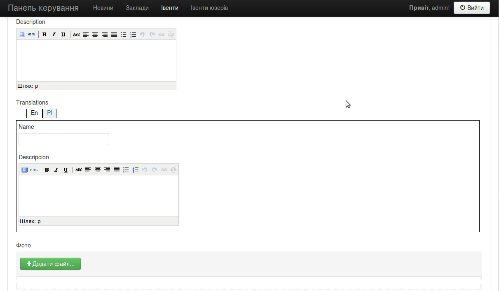

# a2lixTranslationFormBundle integration

[go back to Table of contents][back-to-index]

-----

a2lixTranslationFormBundle allows you to easily manage translatable fields of your entity with a new form type: 'a2lix_translations'.

### 1. a2lixTranslationFormBundle installation and configuration

You can find documentation and examples on how to make fields translatable on the [github page][a2lix-readme] of the bundle.

### 2. Integration with the admin generator

##### 2.1. Stylesheets and javascripts

The bundles stylesheets and javascript files need to be added to the admingenerator templates. In your `YourBundleNameBundle/Resources/config/yourPrefix-generator.yml`:

```yaml
stylesheets:
  - bundles/a2lixtranslationform/css/a2lix_translation.css
javascripts:
  - /bundles/a2lixtranslationform/js/a2lix_translation.js
```

##### 2.2. Minimal form configuration

In your `YourBundleNameBundle/Resources/config/yourPrefix-generator.yml`

```yaml
fields:  :
  translations:
    formType: A2lix\TranslationFormBundle\Form\Type\TranslationsType

```

Then add to your **Edit** and **New** form builders the **translations** field:
```yaml
new:
  params:
    title: Title
    display: [title, description, translations]
    actions:
      save: ~
      list: ~
edit:
  params:
    title: "Edit \"%object%\"|{ %object%: Model.title }|"
    display: [title, description, translations]
    actions:
      save: ~
      list: ~
      delete: ~
```

##### 2.3. Advanced form configuration

Below an example of an advanced form configuration

```yaml
fields:  :
  translations:
    formType: a2lix_translations
    addFormOptions:
      locales: [en, pl]
      required: false
    fields:
      title:
        label : name
        ## OTHER_OPTIONS ##
        locale_options:
          en:
            label : Name
          pl:
            label : Nazwa
      description:
        type: textarea
        ## OTHER_OPTIONS ##
        locale_options:
          en:
            label : Descripcion
          pl:
            label : Opis
```

And add to your **Edit** and **New** form builders **translations** field.

```yaml
new:
  params:
    title: Title
    display: [title, description, translations]
    actions:
      save: ~
      list: ~
edit:
  params:
    title: "Edit \"%object%\"|{ %object%: Model.title }|"
    display: [title, description, translations]
    actions:
      save: ~
      list: ~
      delete: ~
```

##### 2.4. Full  configuration

```yaml
generator: admingenerator.generator.doctrine
params:
  model: Acme\DemoBundle\Entity\YourModel
  namespace_prefix: YourPrefix
  bundle_name: DemoBundle
  fields:
    translations:
      formType: a2lix_translations
      addFormOptions:
        locales: [en, pl]
        required: false
        fields:
          title:
            locale_options:
              en:
                label : Name
              pl:
                label : Nazwa
          description:
            locale_options:
              en:
                label : Descripcion
              pl:
                label : Opis
  stylesheets:
    - bundles/a2lixtranslationform/css/a2lix_translation.css
  javascripts:
    - /bundles/a2lixtranslationform/js/a2lix_translation.js

builders:
  list:
    params:
      title: Title
      display: [title]
      actions:
        new: ~
      object_actions:
        edit: ~
        delete: ~
        show: ~
  filters:
    params:
      display: ~
  new:
    params:
      title: New
      display: [title, description, translations]
      actions:
        save: ~
        list: ~
edit:
  params:
    title: "Edit \"%object%\"|{ %object%: YourModel.title }|"
    display: [title, description, translations]
    actions:
      save: ~
      list: ~
      delete: ~
show:
  params:
    title: "Show  \"%object%\"|{ %object%: YourModel.title }|"
    display: [title, description]
    actions:
      list: ~
      new: ~
      delete: ~
```

##### 2.5. Result




[back-to-index]: ../documentation.md
[a2lix-readme]: https://github.com/a2lix/TranslationFormBundle